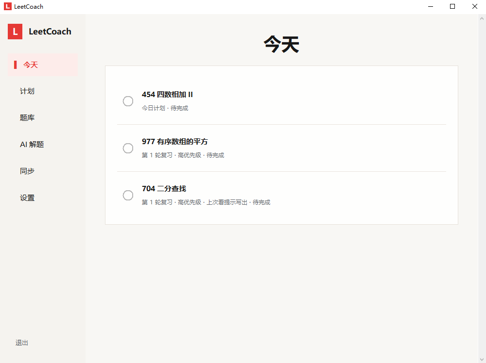
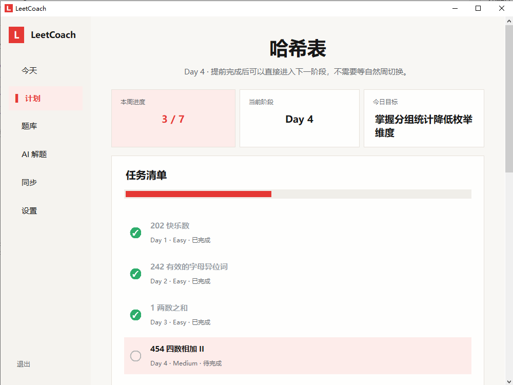
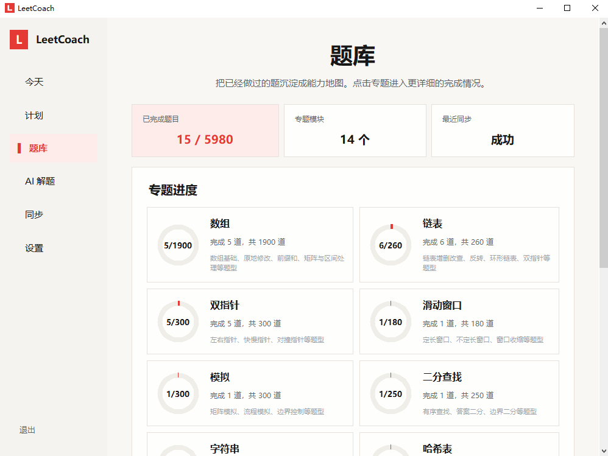
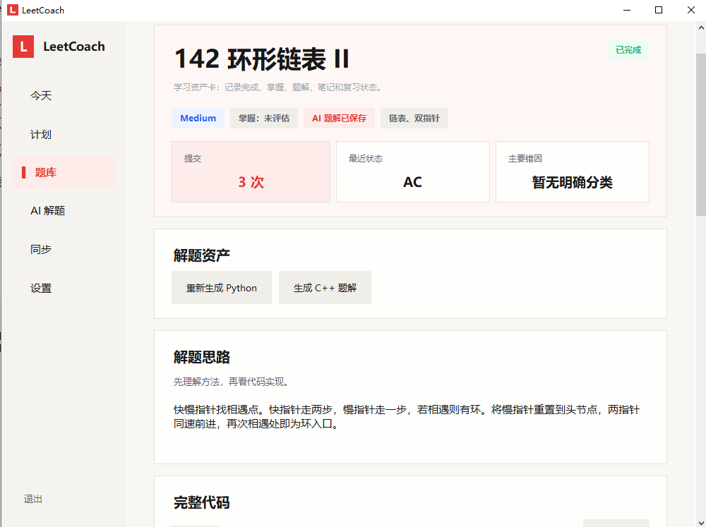
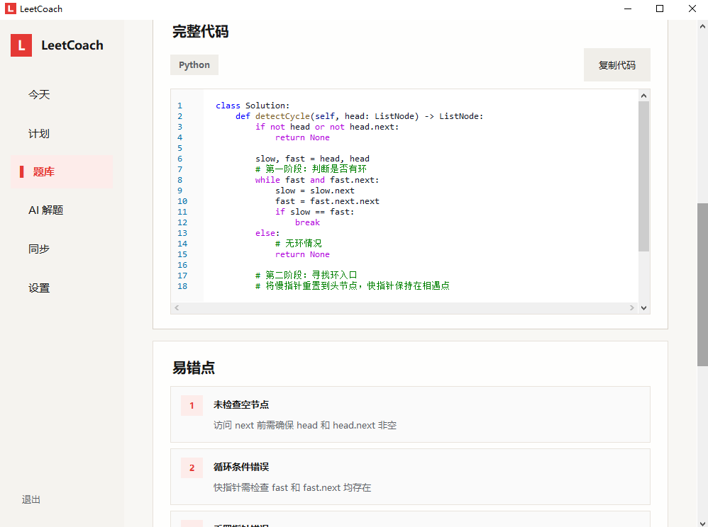
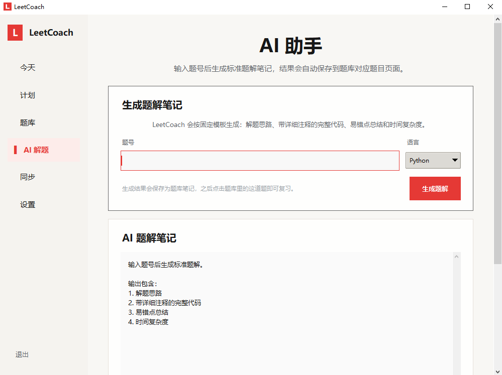

# LeetCoach

LeetCoach 是一个面向长期刷题的个人算法学习管家。

它不是单纯的 AI 题解工具，而是帮助你把刷题任务、复习安排、题库资产、AI 题解笔记和学习计划沉淀到一个简洁的小软件里。

## 项目简介

LeetCoach 的核心目标是减少刷题过程中的管理成本：

- 每天打开软件，只看今天要做什么
- 完成任务后点击圆圈即可记录
- 力扣提交记录可以同步到本地
- 做过的题会沉淀到题库资产中
- AI 题解会保存到对应题目页面
- 学习计划可以结合本地记录、RAG 和 PromptOps 实验持续改进

## 界面预览

### 今日任务



### 任务清单



### 题库能力地图



### 题目资料卡





### AI 解题



## 核心功能

- **今日任务**：每天打开软件，只看到今天要做的题，点击圆圈即可完成。
- **学习计划**：按阶段推进刷题计划，计划草案需要用户确认后才会启用。
- **题库资产**：按专题沉淀完成状态、最近记录、我的笔记和 AI 题解。
- **AI 解题**：生成解题思路、带注释代码、易错点和复杂度分析，并保存到题库。
- **力扣同步**：通过 Chrome 扩展把提交记录推送到本地 LeetCoach。
- **自动复习**：根据完成记录生成复习任务。
- **PromptOps / RAG / Agent 实验**：作为开发者实验能力保留，默认隐藏。

## Windows 安装

Windows 用户可以直接双击：

```bat
setup_windows.bat
```

安装脚本会自动完成：

- 创建本地 `.venv`
- 如果 `.env` 不存在，则生成本地 `.env` 模板
- 可选择打开 `.env` 填写模型配置
- 从示例文件生成 `config/leetcode_config.json`
- 可填写力扣用户名
- 在桌面创建 `LeetCoach` 快捷方式

安装完成后，以后可以直接双击桌面快捷方式启动 LeetCoach。

如果 AI 功能不可用，请检查本地 `.env` 配置。

## 手动启动

```bash
python coach_app.py
```

备用命令行入口：

```bash
python main.py
```

开发者校验：

```powershell
$env:PYTHONPATH="src"
python -m tools.data_validator
python -m unittest discover -s tests
```

## `.env` 配置

公开仓库不会包含 `.env`、API Key、Token 或个人账号配置。

如果你要使用云端大模型，请在 `leetcoach/` 目录或项目上级目录自行创建 `.env`：

```env
LLM_API_KEY=your_api_key_here
LLM_BASE_URL=https://your-model-endpoint
LLM_MODEL=your-model-name
EMBEDDING_API_KEY=your_embedding_key_if_needed
```

不同模型服务商的字段可能不同，请按自己的服务商要求填写。

## 力扣同步配置

复制示例配置：

```bash
copy config\leetcode_config.example.json config\leetcode_config.json
```

填写你的力扣用户名：

```json
{
  "leetcode_username": "your-leetcode-username",
  "site": "leetcode.cn",
  "auto_sync_on_start": true,
  "sync_limit": 20
}
```

Chrome 扩展位于：

```text
extensions/chrome/
```

## 本地模型实验

如果需要实验 Ollama 本地 Embedding：

```bash
copy config\local_model_config.example.json config\local_model_config.json
```

当前建议策略：

- AI 解题：云端模型优先
- AI 计划：云端模型优先
- Embedding：云端优先，本地可作为 fallback
- 本地 LLM：仅作为实验方向，不接入正式主流程

## 开发者模式

公开版本默认隐藏 LLM Lab、PromptOps、RAG 实验、Agent Benchmark 和本地模型实验入口。

如需打开实验入口：

```bash
copy config\app_settings.example.json config\app_settings.json
```

然后修改为：

```json
{
  "developer_mode": true,
  "show_llm_lab": true
}
```

重新运行 `python coach_app.py` 后，可以在“设置”页看到 LLM Lab。

## 项目结构

```text
leetcoach/
  coach_app.py          # GUI 主入口
  main.py               # 备用命令行入口
  setup_windows.bat     # Windows 安装脚本

  installer/
    windows/            # Windows 安装辅助脚本

  src/                  # 核心源码
    app/                # Tkinter UI 与今日任务面板
    core/               # 记录、复习、学习分析
    planning/           # 学习计划生命周期
    library/            # 题库和题目资产
    ai/                 # AI 解题、计划和周总结
    llm/                # LLM 客户端、日志、Prompt、Embedding
    sync/               # 力扣同步与本地同步服务
    agent/              # 静默 Agent 和工具编排
    rag/                # RAG 检索、证据链与评估
    labs/               # PromptOps / RAG / 本地模型实验
    tools/              # 数据校验等维护工具

  resources/
    assets/             # 图标等静态资源
    prompts/            # Prompt 模板
    schemas/            # 结构化输出说明

  extensions/
    chrome/             # 力扣同步 Chrome 扩展

  config/               # 示例配置与默认计划
  data/                 # 公开基础题库
  docs/                 # 产品说明、截图和实验总结
  examples/             # 脱敏示例数据
  tests/                # 自动化测试
```

## 文档

- `docs/current_product_overview.md`：当前产品说明
- `docs/product_direction.md`：产品方向和实验阶段
- `docs/project_structure.md`：目录结构说明
- `docs/github_release_checklist.md`：发布前检查清单
- `docs/local_embedding_strategy.md`：本地 Embedding 策略
- `docs/local_model_experiment_summary.md`：本地模型实验总结

## 项目定位

LeetCoach 的目标是成为一个安静、可靠、长期可用的算法学习管家。

它不应该每天输出大量噪声，而应该把刷题记录、复习任务、题库资产和后续计划管理好。
